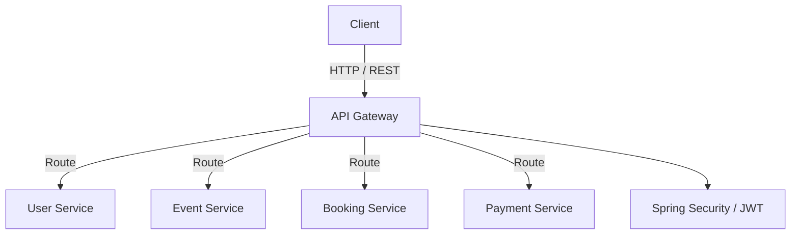

# Event Ticketing - API Gateway

## 📌 Overview

`event-ticketing-api-gateway` is the central entry point for client requests in the Event Ticketing System. It is responsible for routing requests to the appropriate microservices and handling centralized security and request management.

## 🏗️ Service Responsibilities

* Request routing to appropriate microservices.
* Authentication & Authorization utilizing **Spring Security** and **JWT**.
* JWT token validation and request filtering.
* Centralized API access and service communication management.

## 🛠️ Tech Stack

* **Language:** Java 21
* **Framework:** Spring Boot 3.x
* **Gateway:** Spring Cloud Gateway
* **Security:** Spring Security, JWT
* **Containerization:** Docker

## 📐 Architecture

